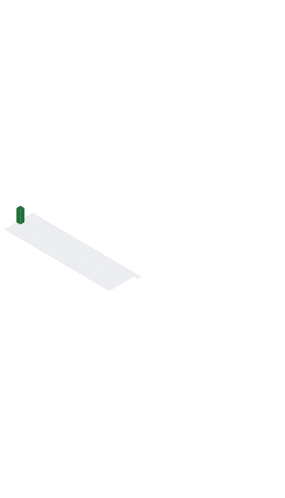

## Hi there 👋 I'm Uladzimir :)

  <b>Senior Systems Engineer | Cloud & DevOps Enthusiast | Mentor @ EPAM Lab</b> 
  <i>Specializing in scalable cloud solutions, Kubernetes orchestration, and automation.</i>

  

---

### 🚀 About Me
- 🔭 **Currently working on:** An **online educational platform** (Telegram WebApp) leveraging GCP, Docker, and GKE for seamless CI/CD.
- 🏗️ **Architecting:** Scalable infrastructure using **Terraform**, **Kubernetes**, and **Google BigQuery**.
- 🌱 **Learning:** Advanced **Google Cloud Workflows**, **Cloud Endpoints**, and **GenAI Integration**.
- 💬 **Ask me about:** **CI/CD best practices**, **GCP architecture**, or how to deploy in under 5 minutes ☕.

---

### 🛠 Tech Stack & Tools

#### ☁️ Cloud & Infrastructure
   

#### ☸️ Orchestration & Containers
  

#### ⚙️ CI/CD & Automation
   

---

  📊 ENGINEERING METRICS

  

  

---

### 📫 Connect with me

  <i>"I once optimized a CI/CD pipeline to deploy in under 5 minutes, fueled by coffee! ☕"</i>

