## Hi there 👋

  I'm <b>Uladzimir Sakhonchyk</b>, a Senior Systems Engineer specializing in Cloud & DevOps with a passion for scalable solutions ☁️

---

  

🔭 **I’m currently working on**  
- An **online educational platform** built with Telegram WebApp, leveraging GCP and Docker for CI/CD and deployment.  
- Scalable cloud infrastructure projects using **Terraform**, **Kubernetes**, and **Google BigQuery**.

🌱 **I’m currently learning**  
- Advanced **Google Cloud Workflows** and **Cloud Endpoints** for microservices orchestration.
- Deepening my expertise in **Python** for automation and data pipelines.

👯 **I’m looking to collaborate on**  
- Open-source **DevOps tools** or **cloud-native projects** involving GCP, AWS, or Kubernetes.
- Educational platforms with innovative UI/UX and cloud integration.

🤔 **I’m looking for help with**  
- Optimizing **GitHub Actions** workflows for complex CI/CD pipelines.
- Exploring **Telegram Bot API** integrations for enhanced WebApp functionality.

💬 **Ask me about**  
- **CI/CD best practices**, **containerization**, or **GCP architecture**.
- My experience mentoring DevOps teams at **EPAM Lab**.

📫 **How to reach me**  
- 📧 Email: zm99by@gmail.com  
- 💼 LinkedIn: [uladzimir-sakhonchyk](https://linkedin.com/in/uladzimir-sakhonchyk-917a4bb9)  
- 🐙 GitHub: [zm99by](https://github.com/zm99by)  
- 🌍 Location: Kraków, Poland / Remote

😄 **Pronouns**  
- He/Him

⚡ **Fun fact**  
- I once optimized a CI/CD pipeline to deploy in under 5 minutes, fueled by coffee and a love for automation! ☕

---

### 🛠 My Skills

  
  
  
  
  
  

- **CI/CD**: Jenkins, GitHub Actions, GitLab CI, Google Cloud Build  
- **Containerization**: Docker, Kubernetes, GKE  
- **IaC**: Terraform, Ansible, Packer  
- **Monitoring**: Prometheus, Grafana, Google Cloud Monitoring  
- **Data**: Apache Kafka, Google BigQuery, Google Dataflow  
- **Automation**: Bash, Python, UNIX Shell  

---
